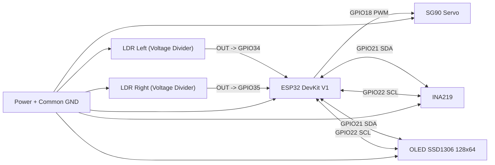
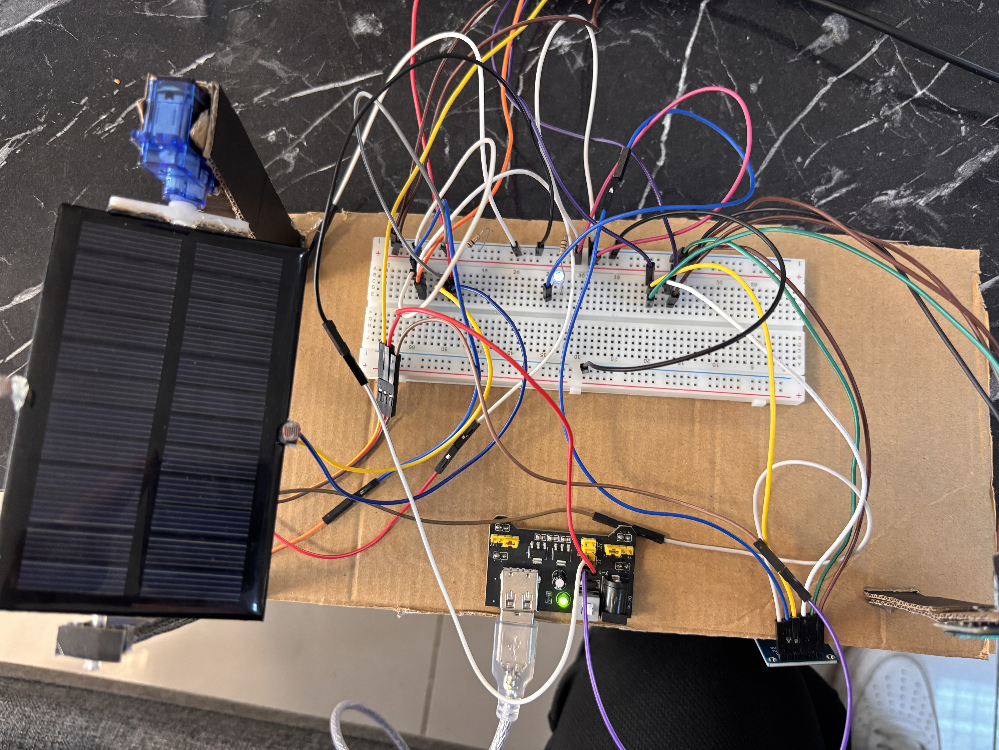
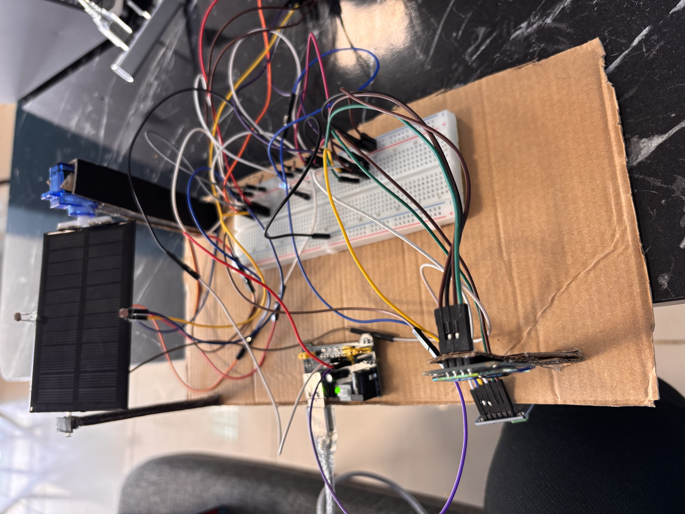
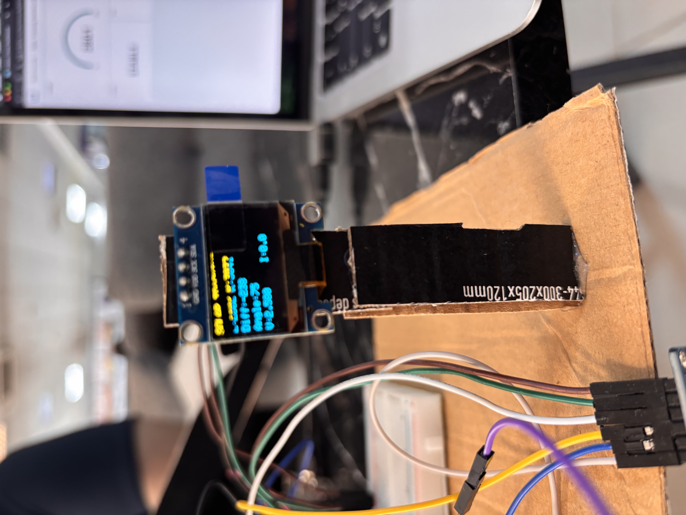
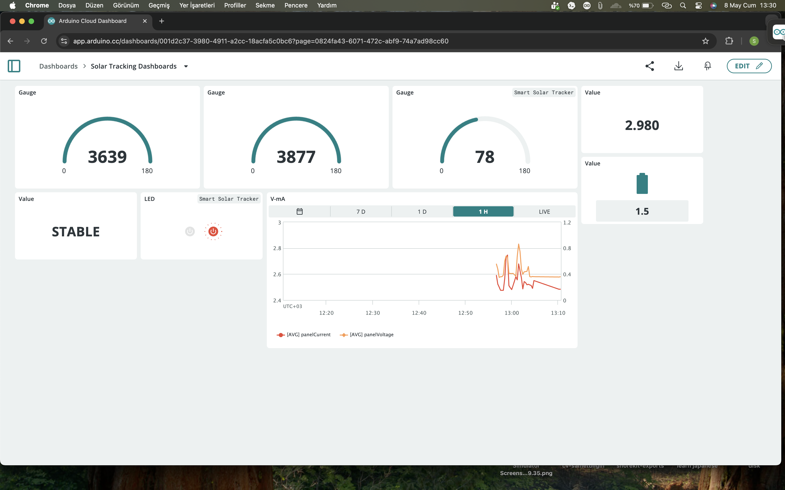

# IoT Solar Tracker Panel System

## Project Summary
This project is an ESP32-based solar tracker panel system developed for CSE328 IoT term work.
Two LDR sensors continuously measure light intensity from left and right sides of the panel.
The controller compares these values and rotates a servo motor toward the stronger light source.
An INA219 sensor measures panel voltage and current for real-time energy monitoring.
A 128x64 I2C OLED displays live sensor values, direction, angle, voltage, and current.
The ESP32 also uploads telemetry to Arduino IoT Cloud over Wi-Fi.
Cloud variables support both remote monitoring and limited dashboard interaction.
Buzzer feedback from the original proposal is not included due to hardware availability.

## Components List
- ESP32 Dev Board (ESP32-WROOM-32 / DOIT DevKit V1)
- LDR Sensor x2 (left and right light sensing)
- INA219 Current/Voltage Sensor
- 128x64 I2C OLED Display (SSD1306)
- SG90 Servo Motor (panel actuator)
- Breadboard, jumper wires, power source, small solar panel

## Wiring Table (GPIO ↔ Module Pins)
| ESP32 GPIO / Pin | Module Pin | Description |
|---|---|---|
| GPIO34 (ADC) | LDR Left output | Left light intensity input |
| GPIO35 (ADC) | LDR Right output | Right light intensity input |
| GPIO18 (PWM) | Servo signal | Servo angle control |
| GPIO21 (SDA) | INA219 SDA + OLED SDA | I2C data line |
| GPIO22 (SCL) | INA219 SCL + OLED SCL | I2C clock line |
| 3V3 / 5V (as required) | Sensor/Display/Servo VCC | Module power |
| GND | All module GND pins | Common ground |

Notes:
- LDRs must be wired as voltage-divider outputs before ADC pins.
- Keep all grounds common for stable ADC and servo behavior.

## Wiring Diagram

## Cloud Setup
Platform: **Arduino IoT Cloud**

Cloud variables used (`thingProperties.h`):
- `ldrLeft` (READ)
- `ldrRight` (READ)
- `servoAngle` (READ)
- `panelVoltage` (READ)
- `panelCurrent` (READWRITE)
- `trackingStatus` (READ)
- `isStable` (READ)

Suggested dashboard widgets:
- Value widget: `ldrLeft`
- Value widget: `ldrRight`
- Gauge/Value widget: `panelVoltage`
- Gauge/Value widget: `panelCurrent`
- Value widget: `servoAngle`
- Status text widget: `trackingStatus`
- Indicator widget: `isStable`

## How To Run
1. Install **Arduino IDE 2.x**.
2. Install board package: `esp32 by Espressif Systems`.
3. Use board setting: `DOIT ESP32 DEVKIT V1` (`esp32:esp32:esp32doit-devkit-v1`).
4. Install libraries:
   - `ArduinoIoTCloud`
   - `Arduino_ConnectionHandler`
   - `Adafruit INA219`
   - `Adafruit GFX`
   - `Adafruit SSD1306`
   - `ESP32Servo`
5. Open `/Untitled_may02a/Untitled_may02a.ino`.
6. Set secrets in `/Untitled_may02a/arduino_secrets.h`:
   - `SECRET_SSID`
   - `SECRET_OPTIONAL_PASS`
   - `SECRET_DEVICE_KEY`
7. Verify that `thingProperties.h` matches your Arduino Cloud Thing/Device.
8. Select correct serial port and upload firmware.
9. Open Serial Monitor at `115200` baud for runtime logs.

## How It Works
1. ESP32 reads `ldrLeft` and `ldrRight` values each loop cycle.
2. The light difference (`left - right`) is compared with a threshold.
3. If difference is positive and above threshold, servo rotates toward one side; if negative, toward the other side; otherwise it stays stable.
4. INA219 provides bus/shunt-based voltage and current measurements.
5. Firmware updates OLED with light values, difference, servo angle, voltage, and current.
6. Firmware publishes telemetry to Arduino IoT Cloud via `ArduinoCloud.update()`.
7. Dashboard can observe all variables in real time; control callbacks are defined for cloud interaction.

## Project Photos

